# deep-learning-challenge

# Report
------------------------------

## OVERVIEW:

###### Using my knowledge of pandas and scikit-learn, I performed preprocessing of charity_data.csv dataset.
###### I also compiled, trained, and evaluated the neural network model by using the features of the dataset
###### to create a binary classifier that can predict whether applicants will be successful if funded by
###### Alphabet Soup

# To accomplish this task, I performed the following steps:

## 1: Preprocess the Data

###### A: Read the csv file

###### B: Drop the EIN and Name columns because they are neither targets or features
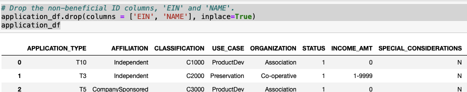

###### C: Checked number of unique columns in DataFrame
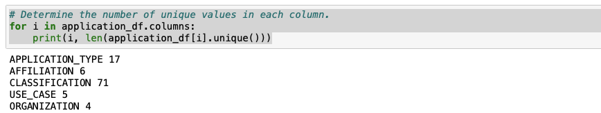

###### D: Cutoff point to bin application and classification types
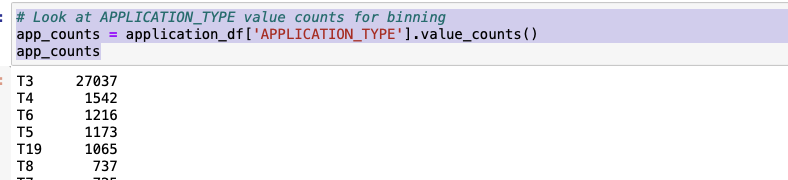
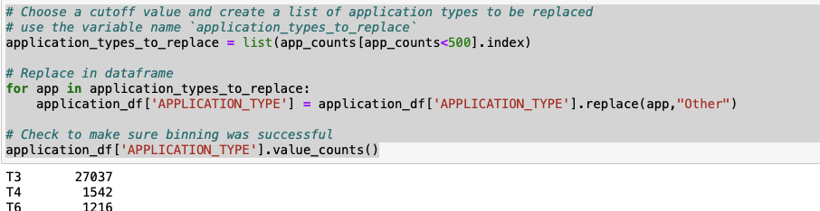
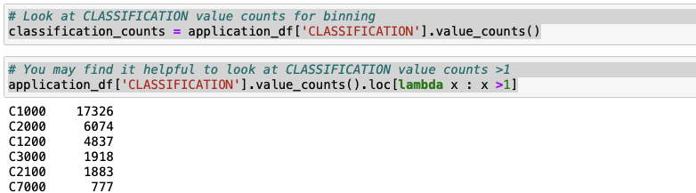
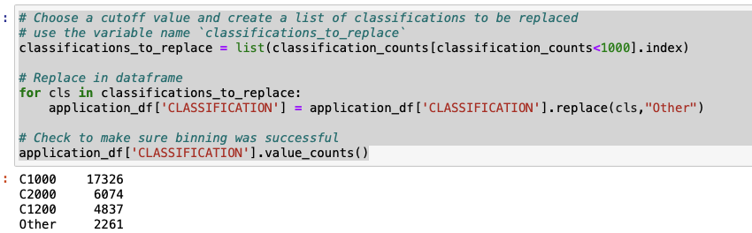

###### E: Coverted categorical data to numeric with pd.get_dummies
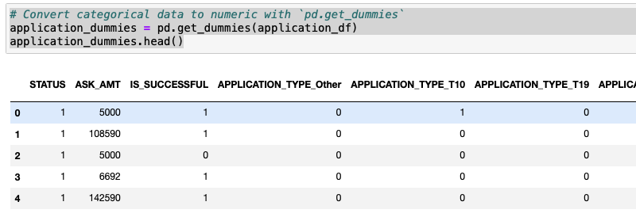

###### F: Split my preprocess data into my features and target arrays
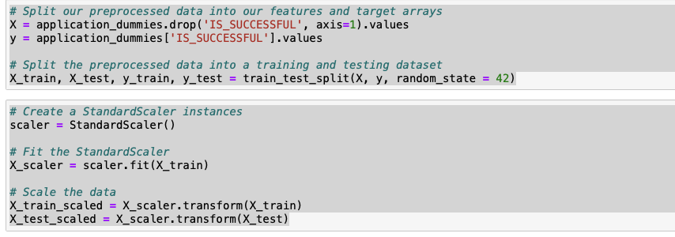

## 2: Compile, Train, and Evaluate the Model

###### G: Created a callback that saves the model's weights every five seconds
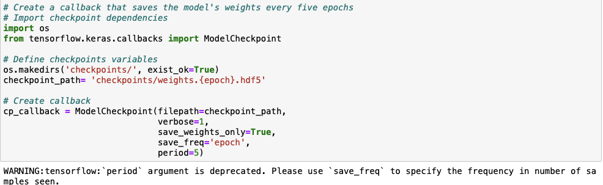
###### H: Compile, train, evaluate

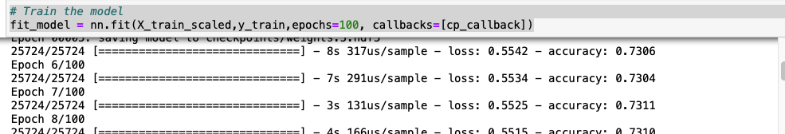
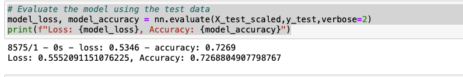
###### I: Saved  and exported results to HDF5 file

# 3: Optimized my Model 

## First Trial
###### J: Created a new jupyter notebook and performed the same preprocessing steps as above but added a third hidden layer
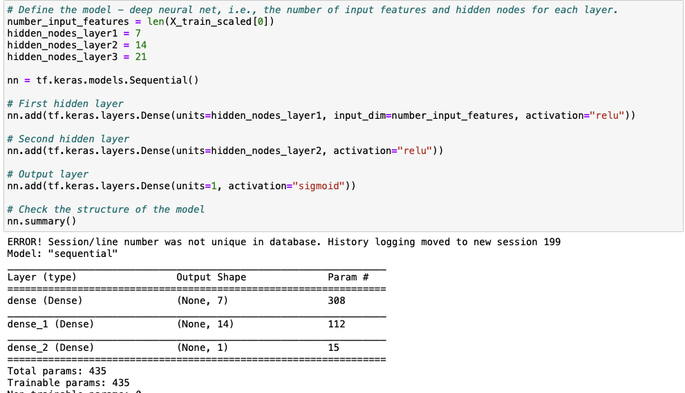
###### K: Evaluation show that only adding a third hidden layer did not reach the target predictive accuracy of 75% or higher
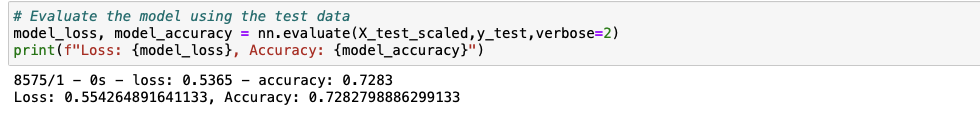

## Second Trial

###### L: Performed preprocessing again as in the steps above but this time only dropping the EIN

###### M: Checked number of unique columns in DataFrame after dropping EIN
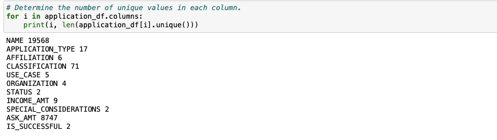

###### N: Cutoff point to bin name, application and classification and Coverted categorical data to numeric with pd.get_dummies
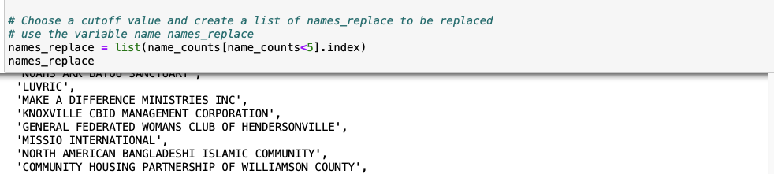
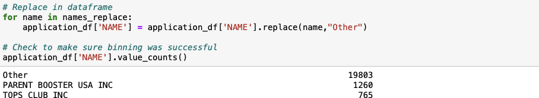
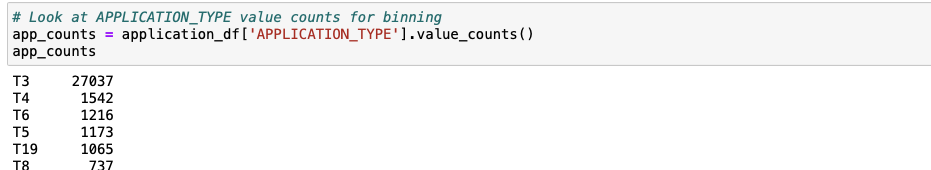
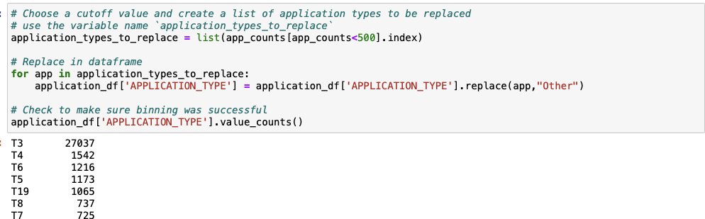
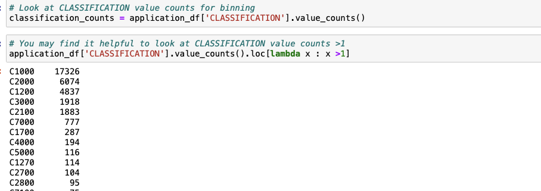
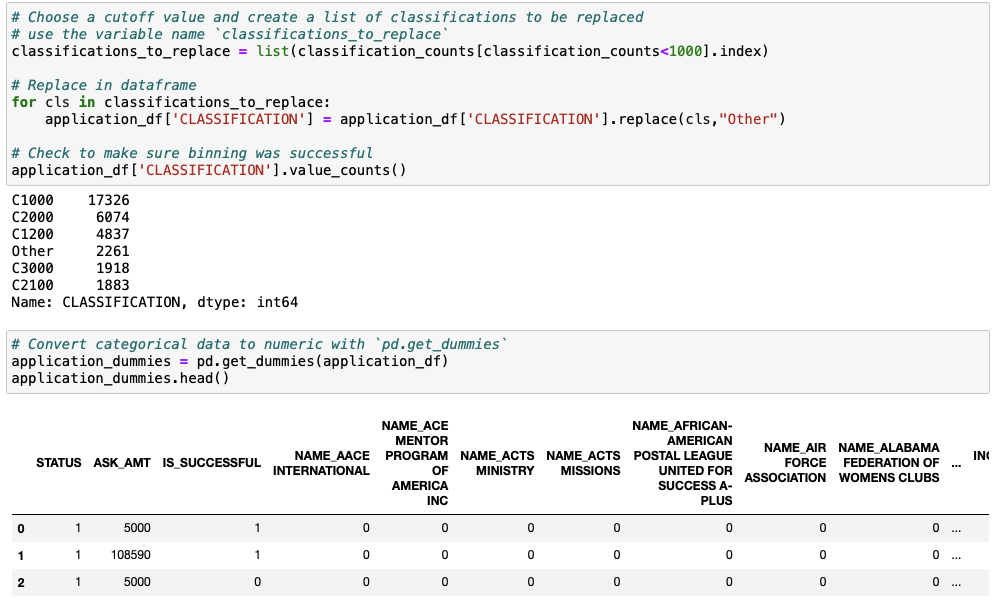

###### O: Split my preprocess data into my features and target arrays
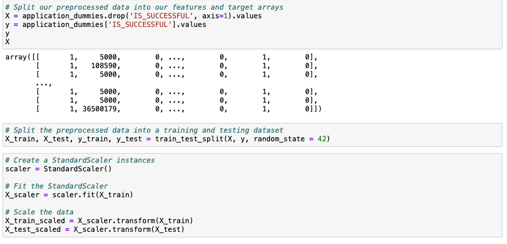

###### P: Compiled, Trained, and Evaluated the Model and added a second instance of the sequential class to form another cluster layer
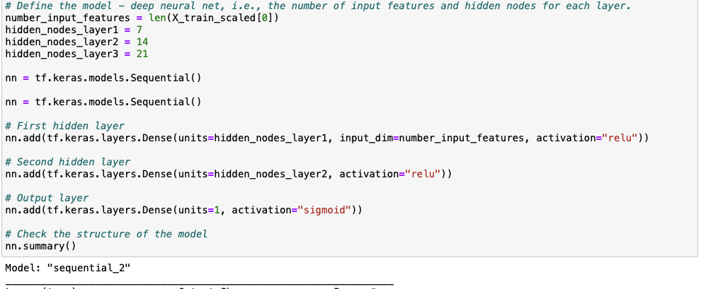
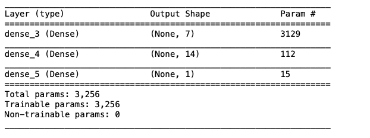
###### Q: By removing just the EIN and adding a second sequential class, you can see the accuracy greatly improves and above the target 75%
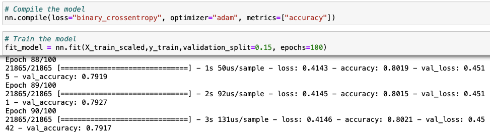
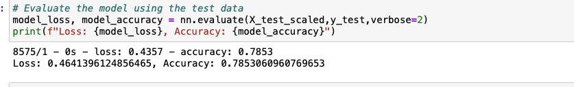

# Conclusion:
###### The final model with the NAME column added back in achieved an accuracy of 78% and a loss of 46%. Keeping the Name column was crucial
###### in achieving and and going beyond the target. This shows the importance of the shape of your datasets before you preprocess it. Deep learning
###### models with multiple layers are better since the model learns how to predict based on filtering inputs through layers

        

